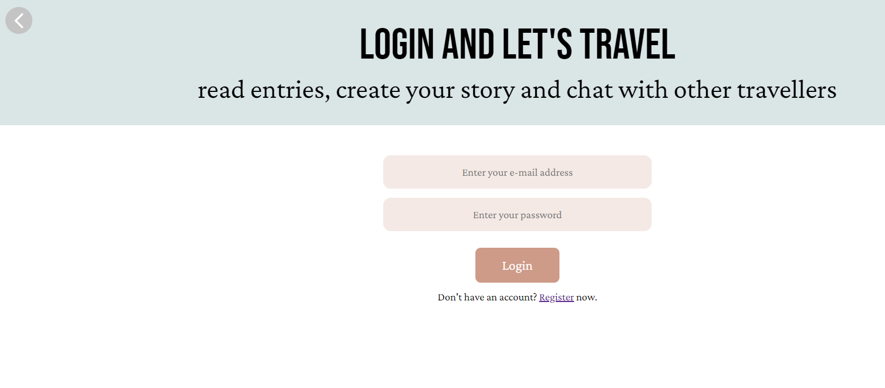
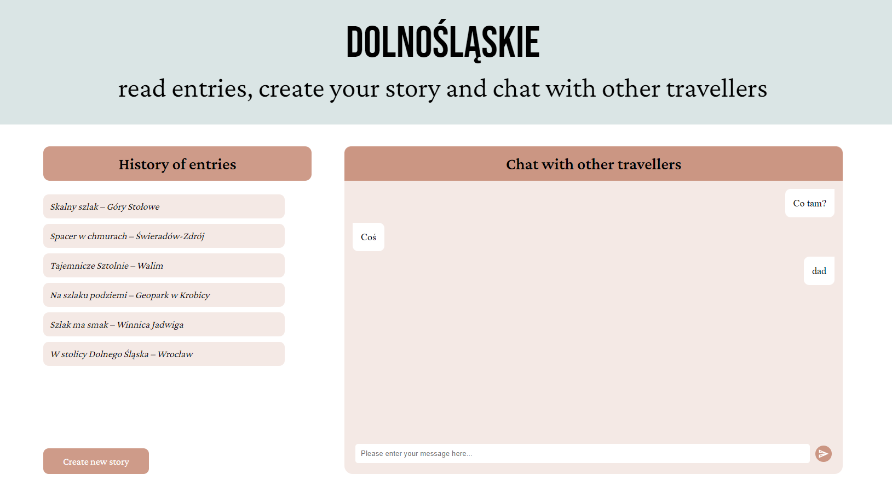
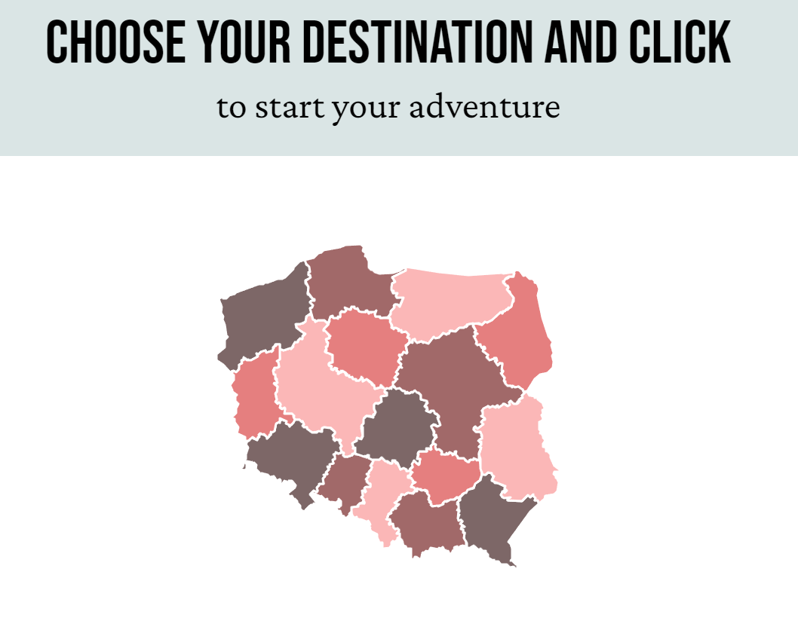

# Chat and Travel project






## Table of contents

- [General info](#general-info)
- [Technologies](#technologies)
- [Setup](#setup)

## General info

This Project it's make for people, who want travel and wanna to share own experiences with other people. Shows some
options with React.js and connecting with Firebase as datebase. We can make photo and add this with short story to
this site, another people with own account can watch this and create another one story. We can also chatting with another
people and exchange experiences or arrange a trip with newly met people. Application can be extended especially for you.
Majority code was written in js file with React technology and all data is saving on firebase server. project was created
by my Coders Camp team.

## Technologies

Project is created with:

- styled.component
- react routing
- react context
- firebase

## Setup

To run this project, visit this link only or download this project to your own computer:

```
https://wycieczki.netlify.app
```
